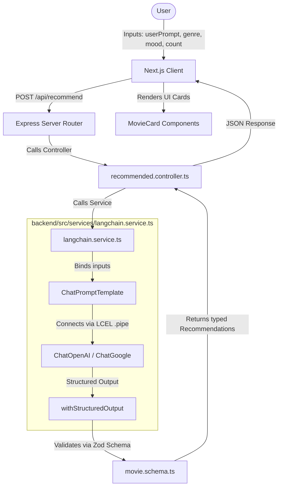

# 🎬 LangChain AI Movie Recommendations & Concepts Showcase

A full-stack, educational crash course application demonstrating how to build a production-ready AI agent using **LangChain JS/TS**, **Express (Node.js)**, **Next.js**, and **Tailwind CSS**.

The project contains two key user experiences:
1. **AI Movie Recommendations Dashboard**: A live client application that captures user mood and genre preferences to query the backend for structured AI-generated movie options.
2. **Interactive Concepts Showcase**: An interactive educational portal mapping frontend concepts to actual backend LangChain implementations (LCEL, Prompts, Structuring, etc.).

---

## 🏛️ Application Architecture & Data Flow

The application is structured as a decoupled monorepo containing a frontend and a backend directory:



---

## 🛠️ Tech Stack

### Backend
- **Core Runtime**: [Node.js](https://nodejs.org/) & [TypeScript](https://www.typescriptlang.org/)
- **Server Framework**: [Express](https://expressjs.com/) (REST APIs, CORS configuration)
- **AI Integration**: [LangChain Core](https://js.langchain.com/) for orchestration
- **Models**: Swappable integration for `@langchain/openai` and `@langchain/google` (Gemini SDK)
- **Validation**: [Zod](https://zod.dev/) for type-safe structured JSON output schemas
- **Development Tools**: [tsx](https://github.com/privatenumber/tsx) for fast TypeScript execution and hot-reloading

### Frontend
- **Framework**: [Next.js 16](https://nextjs.org/) (React 19 App Router)
- **Styling**: [Tailwind CSS v4](https://tailwindcss.com/) with custom gradient schemes
- **UI Components**: [Shadcn UI](https://ui.shadcn.com/) (Card, Button, Select, Skeleton, Textarea)
- **Icons**: [Lucide React](https://lucide.dev/)

---

## 📁 Repository Structure

```
langchain-crash-course/
├── backend/                       # Node.js + Express + LangChain Backend
│   ├── src/
│   │   ├── controllers/           # API request controllers
│   │   │   └── recommended.controller.ts
│   │   ├── routes/                # Express API routes definition
│   │   │   └── recommended.routes.ts
│   │   ├── schemas/               # Zod validation and structured schemas
│   │   │   └── movie.schema.ts
│   │   ├── services/              # Core LangChain LLM setup & LCEL pipelines
│   │   │   └── langchain.service.ts
│   │   └── index.ts               # Server entrypoint and configuration
│   ├── .env                       # Backend API keys and server port settings
│   ├── package.json
│   └── tsconfig.json
│
└── frontend/                      # Next.js Client App
    ├── src/
    │   ├── app/                   # App Router pages
    │   │   ├── showcase/          # /showcase educational dashboard
    │   │   │   └── page.tsx
    │   │   ├── layout.tsx         # Root app layout
    │   │   └── page.tsx           # Home recommendation app page
    │   ├── components/            # Custom application UI components
    │   │   ├── ui/                # Shadcn UI primitives
    │   │   ├── concepts-showcase.tsx
    │   │   ├── movie-card-skeleton.tsx
    │   │   ├── movie-card.tsx
    │   │   └── recommendation-app.tsx
    │   ├── lib/                  
    │   │   ├── api.ts             # Fetch utility for calling the Backend API
    │   │   └── utils.ts
    │   └── types/
    │       └── movie.ts           # Shared TypeScript interfaces
    ├── .env                       # Frontend public environment settings
    ├── package.json
    └── tsconfig.json
```

---

## 🔍 Deep-Dive Explanations of Core Architecture

### 1. Express Routing & Base Prefixes
Routing in Express is **hierarchical (additive)**. The final URL path that is hit from the frontend is constructed by combining the path prefix where the router is mounted with the sub-paths defined inside that router.

* **Mounting the Router** in [`backend/src/index.ts`](file:///C:/Users/gupta/Downloads/1782308214430-24f5e577b633953a/langchain-crash-course/backend/src/index.ts#L15):
  ```typescript
  app.use("/api/recommend", recommendRouter);
  ```
  This registers `recommendRouter` under the string prefix `"/api/recommend"`.
* **Defining Endpoints** in [`backend/src/routes/recommended.routes.ts`](file:///C:/Users/gupta/Downloads/1782308214430-24f5e577b633953a/langchain-crash-course/backend/src/routes/recommended.routes.ts#L6):
  ```typescript
  recommendRouter.post("/", recommendedMovies);
  ```
  This registers a handler on the path `"/"` relative to the router.
* **Resulting Match**:
  $$\text{Prefix} + \text{Sub-path} = \text{Combined Path}$$
  $$\text{"/api/recommend"} + \text{"/"} = \text{"/api/recommend"}$$
  
  Therefore, any `POST` request sent from the frontend to `/api/recommend` automatically enters the `recommendedMovies` controller function.

---

### 2. Request Handling: Destructuring & Default Values
Inside [`backend/src/controllers/recommended.controller.ts`](file:///C:/Users/gupta/Downloads/1782308214430-24f5e577b633953a/langchain-crash-course/backend/src/controllers/recommended.controller.ts#L9-L14):
```typescript
const {
  userPrompt = "Suggest movies for a rainy night",
  genre = "thriller",
  mood = "relaxed",
  count = 2,
} = req.body;
```
* **Destructuring Assignment**: This syntax extracts properties from the `req.body` object and assigns them to local variables.
* **Fallback Defaults**: The `= "..."` values are only used if the incoming request properties are `undefined`. If the user types a custom prompt (like *"space travel movies"*) on the frontend, `req.body.userPrompt` contains that text. The JavaScript engine assigns the user's custom string to `userPrompt` and **completely ignores the default fallback string**.

---

### 3. Asynchronous Execution in Controllers
Calling LLMs takes time (seconds), so operations must run asynchronously. In Express, you can write handlers using modern `async/await` syntax or classic Promise-based chain syntax.

#### Modern Async/Await Syntax (Actual Code):
```typescript
export async function recommendedMovies(req: Request, res: Response) {
  try {
    const { userPrompt, genre, mood, count } = req.body;

    // Execution PAUSES here until the LLM API responds.
    const result = await getStructuredRecommendations({ userPrompt, genre, mood, count });

    // Sends the final JSON back to the client.
    res.json(result);
  } catch (error) {
    console.log(error);
    res.status(500).json({ error: "Something goes wrong" });
  }
}
```

#### Equivalent Promise-Based `.then()/.catch()` Syntax:
```typescript
export function recommendedMovies(req: Request, res: Response) {
  const { userPrompt, genre, mood, count } = req.body;

  // Triggers the promise-returning function without blocking.
  getStructuredRecommendations({ userPrompt, genre, mood, count })
    .then((result) => {
      res.json(result); // Runs when the LLM successfully responds
    })
    .catch((error) => {
      console.log(error); // Intercepts any API failures
      res.status(500).json({ error: "Something goes wrong" });
    });
}
```

---

### 4. Under the Hood of `chain.invoke()`
When you call `await chain.invoke(...)` inside [`backend/src/services/langchain.service.ts`](file:///C:/Users/gupta/Downloads/1782308214430-24f5e577b633953a/langchain-crash-course/backend/src/services/langchain.service.ts#L85-L103), the following pipeline triggers sequentially:

1. **Placeholder Interpolation**: LangChain scans the `ChatPromptTemplate` messages for variables wrapped in curly braces (`{userPrompt}`, `{genre}`, `{mood}`, `{count}`). It substitutes them with the real values provided in the `.invoke()` argument, outputting a compiled array of `[SystemMessage, HumanMessage]`.
2. **Payload Serialization**: The generic message array is forwarded down the pipe to the `structuredModel` wrapper. LangChain converts the messages into the specific shape expected by the active provider (OpenAI or Google APIs). It also translates your Zod schema into a JSON Schema and attaches it to the call parameters.
3. **LLM Inference Constraints**: The model server receives the payload. Because the schema configuration was attached, the model provider's API forces the model to generate its completion strictly adhering to the JSON schema format (ensuring no conversational chat text interferes).
4. **Validation and Return**: The raw completion is received back by LangChain's internal output parser. It parses the JSON text into a standard JavaScript object and runs `RecommendationsSchema.parse(object)`. If the validation passes, the resulting typed object is returned directly; if it fails, Zod throws a validation error.

---

### 5. Prompt Engineering via Zod `.describe()`
In [`backend/src/schemas/movie.schema.ts`](file:///C:/Users/gupta/Downloads/1782308214430-24f5e577b633953a/langchain-crash-course/backend/src/schemas/movie.schema.ts), Zod defines the structure of data:

```typescript
export const MovieSchema = z.object({
  title: z.string().describe("Movie Title"),
  year: z.number().describe("Release year"),
  reason: z.string().describe("Why this matches the user's mood and preference"),
  rating: z.number().min(1).max(10).describe("IMDB style rating out of 10"),
});
```
The `.describe()` method is critical. When LangChain generates the JSON Schema payload for the LLM API, **it maps the description strings directly to descriptions in the schema**. The LLM reads these strings as explicit guidelines:
* The LLM reads `"Why this matches the user's mood and preference"` to know what style of reasoning to write inside the `reason` field.
* The LLM reads `"IMDB style rating out of 10"` to understand it must compute an integer or floating-point rating scale.

---

### 6. Start-Up LLM Switcher vs. Runtime Fallbacks
In [`backend/src/services/langchain.service.ts`](file:///C:/Users/gupta/Downloads/1782308214430-24f5e577b633953a/langchain-crash-course/backend/src/services/langchain.service.ts#L8-L24):
```typescript
function getChatModel() {
  const provider = process.env.LLM_PROVIDER ?? "openai";
  ...
}
```
* **Startup-Time Selection**: This logic executes only **once** when the server starts up.
* **No Runtime Fallback**: If you set `LLM_PROVIDER=openai` in `.env`, the server uses `ChatOpenAI`. If the OpenAI API throws an error at runtime, the request will immediately fail and go to the controller's catch block.
* **Enabling Fallbacks**: If you want to automatically attempt Gemini if OpenAI fails at runtime, you can configure LangChain's built-in `.withFallbacks()`:
  ```typescript
  const structuredPrimary = primaryModel.withStructuredOutput(schema);
  const structuredFallback = fallbackModel.withStructuredOutput(schema);
  const chain = promptTemplate.pipe(
    structuredPrimary.withFallbacks({ fallbacks: [structuredFallback] })
  );
  ```

---

## 🚀 Setup & Installation Steps

### 1. Clone & Navigate to Backend
Open your terminal and navigate to the backend directory:
```bash
cd backend
```

### 2. Configure Backend Environment
Create a `.env` file inside the `backend/` directory with the following structure:
```ini
PORT=8000
LLM_PROVIDER=openai       # Choose 'openai' or 'google'
OPENAI_API_KEY=your-openai-api-key
GOOGLE_API_KEY=your-gemini-api-key
OPENAI_MODEL=gpt-4o-mini
```

### 3. Install & Start the Backend
Install the server dependencies and start the hot-reloading dev server:
```bash
npm install
npm run dev
```
The backend server will run at [http://localhost:8000](http://localhost:8000). You can verify its health at [http://localhost:8000/health](http://localhost:8000/health).

---

### 4. Setup the Frontend
Open a new terminal window, and navigate to the frontend directory:
```bash
cd frontend
```

### 5. Configure Frontend Environment
Ensure the `.env` file inside the `frontend/` directory points to the backend API url:
```ini
NEXT_PUBLIC_API_URL=http://localhost:8000
```

### 6. Install & Start the Frontend
Install dependencies and run the client dev server:
```bash
npm install
npm run dev
```
The frontend application will boot up at [http://localhost:3000](http://localhost:3000).

---

## 🔌 API Endpoints

### 1. Check Server Health
- **URL**: `/health`
- **Method**: `GET`
- **Response**:
```json
{
  "status": "ok"
}
```

### 2. Generate Recommendations
- **URL**: `/api/recommend`
- **Method**: `POST`
- **Headers**: `Content-Type: application/json`
- **Request Body**:
```json
{
  "userPrompt": "Suggest sci-fi movies set in deep space",
  "genre": "sci-fi",
  "mood": "curious",
  "count": 3
}
```
- **Response**:
```json
{
  "movies": [
    {
      "title": "Interstellar",
      "year": 2014,
      "genre": ["Sci-Fi", "Drama", "Adventure"],
      "cast": ["Matthew McConaughey", "Anne Hathaway", "Jessica Chastain"],
      "reason": "It offers an intense depiction of space travel, matching your curious mood and request for a deep space setting.",
      "rating": 8.7
    }
  ]
}
```
