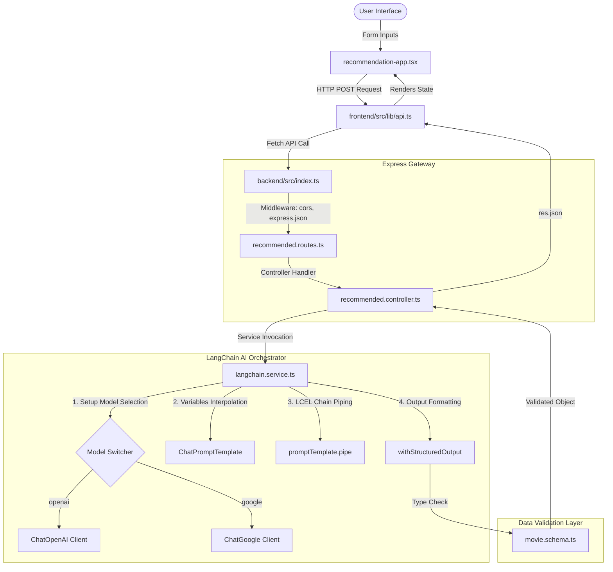

# 📖 Full-Stack Developer Architecture & Deep-Dive Guide

Welcome to the comprehensive architecture guide for your AI Movie Recommendation and LangChain Concepts Showcase codebase. This documentation covers every aspect of the project, including the core components, data flow, routing mechanics, asynchronous lifecycles, and deep details about the AI and LangChain layers.

---

## 🏛️ 1. High-Level Architectural Blueprint

The application is built using a **decoupled Client-Server pattern**:



---

## 📁 2. Codebase Directory Deep-Dive

Here is the exact path mapping of the key source files within your workspace:

### Backend Workspace (`backend/`)
* **[`backend/src/index.ts`](file:///C:/Users/gupta/Downloads/1782308214430-24f5e577b633953a/langchain-crash-course/backend/src/index.ts)**: Configures Express, CORS policies, JSON parsing middleware, and registers API entry prefixes.
* **[`backend/src/routes/recommended.routes.ts`](file:///C:/Users/gupta/Downloads/1782308214430-24f5e577b633953a/langchain-crash-course/backend/src/routes/recommended.routes.ts)**: Registers routes for recommendation handlers and maps HTTP verbs (like `POST`) to their corresponding controller functions.
* **[`backend/src/controllers/recommended.controller.ts`](file:///C:/Users/gupta/Downloads/1782308214430-24f5e577b633953a/langchain-crash-course/backend/src/controllers/recommended.controller.ts)**: Destructures user input from the request body, sets up default backup values, runs business logic catch blocks, and transmits JSON responses back to the browser.
* **[`backend/src/services/langchain.service.ts`](file:///C:/Users/gupta/Downloads/1782308214430-24f5e577b633953a/langchain-crash-course/backend/src/services/langchain.service.ts)**: Houses the Model selection engine, the LCEL pipe configurations, the Chat Prompts Templates, and interacts with LLM endpoints.
* **[`backend/src/schemas/movie.schema.ts`](file:///C:/Users/gupta/Downloads/1782308214430-24f5e577b633953a/langchain-crash-course/backend/src/schemas/movie.schema.ts)**: Declares data boundaries using Zod. Instructs the AI engine how to format fields.

### Frontend Workspace (`frontend/`)
* **[`frontend/src/app/page.tsx`](file:///C:/Users/gupta/Downloads/1782308214430-24f5e577b633953a/langchain-crash-course/frontend/src/app/page.tsx)**: Main page routing for the movie selection dashboard.
* **[`frontend/src/components/recommendation-app.tsx`](file:///C:/Users/gupta/Downloads/1782308214430-24f5e577b633953a/langchain-crash-course/frontend/src/components/recommendation-app.tsx)**: Main application wrapper containing user form fields, dropdowns, buttons, loading state trackers, and API integration.
* **[`frontend/src/app/showcase/page.tsx`](file:///C:/Users/gupta/Downloads/1782308214430-24f5e577b633953a/langchain-crash-course/frontend/src/app/showcase/page.tsx)**: Main showcase route.
* **[`frontend/src/components/concepts-showcase.tsx`](file:///C:/Users/gupta/Downloads/1782308214430-24f5e577b633953a/langchain-crash-course/frontend/src/components/concepts-showcase.tsx)**: Informative card showcase outlining the LangChain modules mapped to their visual backend explanations.
* **[`frontend/src/lib/api.ts`](file:///C:/Users/gupta/Downloads/1782308214430-24f5e577b633953a/langchain-crash-course/frontend/src/lib/api.ts)**: Client HTTP caller utility that runs POST requests to backend endpoints.

---

## 🔀 3. Express Routing Mechanics (Under the Hood)

One of the common points of confusion in routing is how paths are matched. Express routes are **hierarchical and additive**:

### The mount prefix in [`index.ts`](file:///C:/Users/gupta/Downloads/1782308214430-24f5e577b633953a/langchain-crash-course/backend/src/index.ts#L15):
```typescript
app.use("/api/recommend", recommendRouter);
```
This tells Express: *"Any request that starts with `/api/recommend` should enter `recommendRouter`."*

### The endpoint inside [`recommended.routes.ts`](file:///C:/Users/gupta/Downloads/1782308214430-24f5e577b633953a/langchain-crash-course/backend/src/routes/recommended.routes.ts#L6):
```typescript
recommendRouter.post("/", recommendedMovies);
```
This registers a `POST` handler at the route `"/"` inside the sub-router.

### How they combine:
Express appends the sub-router path to the mount prefix:
$$\text{Mount Prefix} + \text{Router Sub-path} = \text{Target Route}$$
$$\text{"/api/recommend"} + \text{"/"} = \text{"/api/recommend"}$$

* If you were to register `recommendRouter.get("/list", ...)` in the future, the route would resolve to `GET /api/recommend/list`.

---

## 🔄 4. Request Lifecycle & Asynchronous Mechanics

When a request arrives, the application must process variables, perform an external network request to the LLM provider, validate the response, and return the data.

### Destructuring & Fallback values
Inside [`recommended.controller.ts`](file:///C:/Users/gupta/Downloads/1782308214430-24f5e577b633953a/langchain-crash-course/backend/src/controllers/recommended.controller.ts#L9-L14):
```typescript
const {
  userPrompt = "Suggest movies for a rainy night",
  genre = "thriller",
  mood = "relaxed",
  count = 2,
} = req.body;
```
* **Destructuring**: Extracts keys (`userPrompt`, `genre`, etc.) directly from `req.body` and binds them to local variables.
* **Fallbacks**: If the key is not present in `req.body` (i.e. is `undefined`), JS assigns the fallback default (e.g. `"Suggest movies for a rainy night"`). If the user types a custom prompt on the frontend, `req.body.userPrompt` is defined, and the default value is **completely ignored**.

### Async/Await vs. Promise-Based Syntax
Asynchronous operations represent actions that take time (like a network call to the LLM). Here is how the controller code translates between the modern `async/await` syntax and the older `.then()/.catch()` promise syntax:

#### Modern Async/Await Syntax (Actual Code):
```typescript
export async function recommendedMovies(req: Request, res: Response) {
  try {
    const { userPrompt, genre, mood, count } = req.body;

    // Execution PAUSES here until the LLM API responds.
    const result = await getStructuredRecommendations({ userPrompt, genre, mood, count });

    // This line only runs after the LLM request completes successfully.
    res.json(result);
  } catch (error) {
    // If the LLM call fails, execution jumps here instantly.
    console.log(error);
    res.status(500).json({ error: "Something goes wrong" });
  }
}
```

#### Promise-Based Syntax Equivalent:
```typescript
export function recommendedMovies(req: Request, res: Response) {
  const { userPrompt, genre, mood, count } = req.body;

  // We invoke the promise-returning function without pausing the main execution thread.
  getStructuredRecommendations({ userPrompt, genre, mood, count })
    // Runs when the promise successfully resolves.
    .then((result) => {
      res.json(result);
    })
    // Intercepts and handles errors if the promise is rejected.
    .catch((error) => {
      console.log(error);
      res.status(500).json({ error: "Something goes wrong" });
    });
}
```

---

## 🤖 5. LangChain & LLM Integration Deep Dive

This explains exactly what happens inside **[`langchain.service.ts`](file:///C:/Users/gupta/Downloads/1782308214430-24f5e577b633953a/langchain-crash-course/backend/src/services/langchain.service.ts)** during execution of:

```typescript
const result = await chain.invoke({ userPrompt, genre, mood, count });
```

### Detailed Sequence of Events:

#### 1. Message Rendering & Placeholder Interpolation
The first link in the pipe is the `promptTemplate`. LangChain takes the input variables and merges them into the templates:
- It processes the system prompt, setting the AI rules.
- It parses the user template, finding placeholders wrapped in `{}` like `{userPrompt}`, `{genre}`, `{mood}`, and `{count}`.
- It returns an array of structured prompt messages (`[SystemMessage, HumanMessage]`).

#### 2. Translation & Payload Transmission
The messages are passed to the `structuredModel` (which wraps our LLM Client: `ChatOpenAI` or `ChatGoogle`).
- LangChain converts the generic message array into the specific provider's payload structure.
- **Injecting the Zod Schema**: Since we initialized the model with `.withStructuredOutput(RecommendationsSchema)`, LangChain translates the Zod Schema definition into a standard **JSON Schema** definition and passes it inside the payload configuration (like OpenAI's `response_format` or Gemini's `responseSchema`).
- The SDK initiates a network API post call to the model provider.

#### 3. Constrained Inference on LLM Server
- The LLM processes the instructions and generates output.
- Because a structured schema was provided during the API call, the provider's API constrains the LLM inference output. The model is forced to yield a valid JSON string matching the exact structure and keys defined by the schema.

#### 4. Response Parsing & Schema Validation
- The raw response arrives back at our backend.
- LangChain takes the returned text, parses it as a standard JavaScript object (`JSON.parse()`), and evaluates it against the Zod validator:
  ```typescript
  RecommendationsSchema.parse(parsedJsonObject);
  ```
- If validation passes, the resulting typed object is returned directly. If any type matches fail, Zod throws an exception which triggers the controller's error handlers.

---

## 🛡️ 6. Data Validation Schema

Inside **[`movie.schema.ts`](file:///C:/Users/gupta/Downloads/1782308214430-24f5e577b633953a/langchain-crash-course/backend/src/schemas/movie.schema.ts)**, Zod schemas ensure predictability:

```typescript
export const MovieSchema = z.object({
  title: z.string().describe("Movie Title"),
  year: z.number().describe("Release year"),
  genre: z.array(z.string()).describe("List of genre"),
  cast: z.array(z.string()).describe("Top 3 cast members"),
  reason: z.string().describe("Why this matches the user's mood and preference"),
  rating: z.number().min(1).max(10).describe("IMDB style rating out of 10"),
});
```

### The Role of `.describe(...)`
While TypeScript uses schemas to validate types during execution, **LangChain feeds the text inside `.describe()` directly to the LLM**. This acts as inline prompt engineering:
- The LLM reads `describe("Why this matches the user's mood and preference")` and understands the exact context of what to write in `reason`.
- The LLM reads `describe("IMDB style rating out of 10")` and understands it needs to compute a rating scale.

---

## 🛠️ 7. Dynamic Provider Switcher Configuration

In [`langchain.service.ts`](file:///C:/Users/gupta/Downloads/1782308214430-24f5e577b633953a/langchain-crash-course/backend/src/services/langchain.service.ts#L8-L24):

```typescript
function getChatModel() {
  const provider = process.env.LLM_PROVIDER ?? "openai";
  ...
}
```

* This check runs **once** at server startup.
* If `LLM_PROVIDER` in your backend `.env` is set to `"openai"`, the condition `provider === "google"` evaluates to `false`. The model client returns `ChatOpenAI` and **Gemini will not be instantiated or used anywhere** in the app.
* If you set `LLM_PROVIDER=google`, the app launches `ChatGoogle` (Gemini-2.5-flash) and bypasses OpenAI.
* This logic handles initialization at startup, but **does not act as a runtime fallback**. If your chosen API provider fails while handling a request, the request will immediately fail (unless a fallback chain with `.withFallbacks()` is added).
